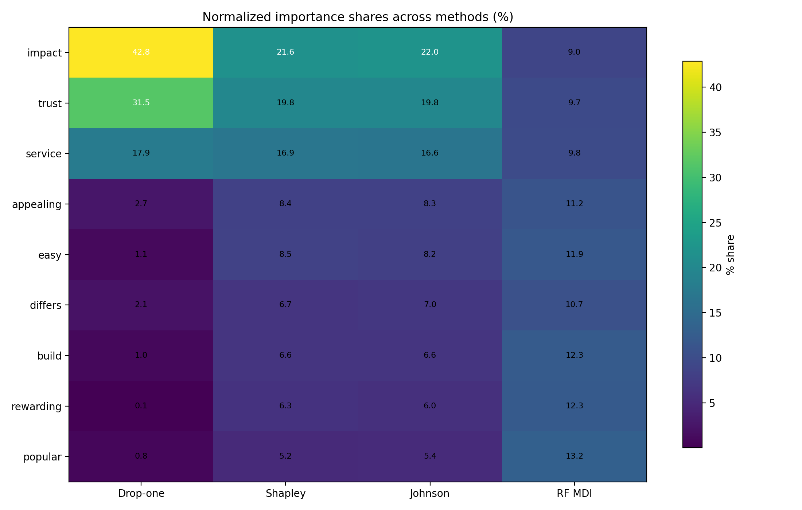
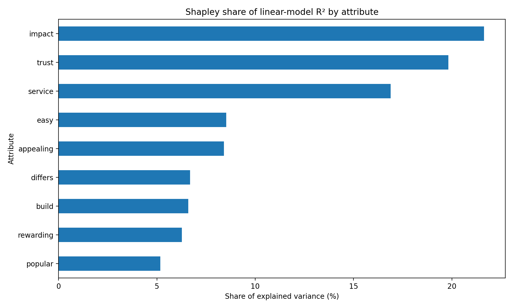

This post replicates the key-drivers comparison table using the attached survey data. I treat **satisfaction** as the outcome and the nine binary attribute variables as candidate drivers: trust, build, differs, easy, appealing, rewarding, popular, service, and impact. I report the six requested metrics: Pearson correlations, standardized linear-regression coefficients, drop-one usefulness, exact Shapley values for linear-regression $R^2$, Johnson's relative weights, and random-forest mean decrease in Gini importance.

## Data and setup

- **Rows:** 2,553 survey responses
- **Outcome:** satisfaction (1 to 5)
- **Predictors:** 9 binary brand-image / experience items
- **Excluded columns:** `brand` and `id` are identifiers / grouping columns, so they are not used as drivers in the core table.

Method choices:

1. **Pearson correlation**: bivariate association between each attribute and satisfaction.
2. **Standardized regression coefficient**: OLS with z-scored outcome and predictors.
3. **Drop-one usefulness**: decrease in full-model $R^2$ when one attribute is removed.
4. **Shapley values**: exact Shapley decomposition of linear-regression $R^2$ across all $2^9 = 512$ subsets.
5. **Johnson's relative weights**: orthogonalized decomposition of explained variance for the same linear model.
6. **Random forest importance**: mean decrease in Gini from a random-forest classifier predicting the 5-level satisfaction outcome.

I omitted polychoric correlations, which the assignment says are optional.

## Replicated key-drivers table

The table below is ordered by an overall rank that averages the rank positions from the six requested metrics.

|   Overall rank | Attribute   |   Pearson r |   Std. beta |   Drop-one usefulness |   Shapley (R²) |   Johnson rel. weight |   RF mean decrease in Gini |
|---------------:|:------------|------------:|------------:|----------------------:|---------------:|----------------------:|---------------------------:|
|              1 | impact      |      0.2545 |      0.1284 |                0.0112 |         0.0236 |                0.0239 |                     0.0901 |
|              2 | trust       |      0.2557 |      0.1158 |                0.0082 |         0.0216 |                0.0216 |                     0.0967 |
|              3 | service     |      0.2511 |      0.0884 |                0.0047 |         0.0184 |                0.0181 |                     0.0981 |
|              4 | appealing   |      0.208  |      0.0338 |                0.0007 |         0.0092 |                0.0091 |                     0.1118 |
|              5 | easy        |      0.213  |      0.022  |                0.0003 |         0.0093 |                0.009  |                     0.1188 |
|              6 | differs     |      0.1848 |      0.0278 |                0.0006 |         0.0073 |                0.0076 |                     0.1068 |
|              7 | build       |      0.1919 |      0.02   |                0.0003 |         0.0072 |                0.0072 |                     0.1231 |
|              8 | rewarding   |      0.1946 |      0.0051 |                0      |         0.0068 |                0.0065 |                     0.1225 |
|              9 | popular     |      0.1714 |      0.0166 |                0.0002 |         0.0056 |                0.0059 |                     0.1321 |

## Interpreting the table

A few patterns are stable across the methods:

- **Impact** is the clearest overall driver. It ranks first on the variance-decomposition methods and also has the largest standardized regression coefficient.
- **Trust** is a very close second. It has the highest Pearson correlation and remains near the top across all linear-model methods.
- **Service** is consistently third-tier but still materially stronger than the remaining attributes.
- The remaining attributes look weaker and more method-dependent. In particular, the random forest puts relatively more weight on **popular**, **build**, and **rewarding** than the linear-model methods do, which suggests some nonlinear or interaction-style structure.

The full linear model explains about **10.9%** of the variance in satisfaction ($R^2 = 0.1090$). That is not huge, but it is reasonable for short attitudinal survey batteries where each individual item is binary.

## Normalized importance shares

Because the variance-allocation methods sum to a total, it is useful to compare them on a percentage-share basis.

| Attribute   |   Drop-one share % |   Shapley share % |   Johnson share % |   RF share % |
|:------------|-------------------:|------------------:|------------------:|-------------:|
| impact      |               42.8 |              21.6 |              22   |          9   |
| trust       |               31.5 |              19.8 |              19.8 |          9.7 |
| service     |               17.9 |              16.9 |              16.6 |          9.8 |
| easy        |                1.1 |               8.5 |               8.2 |         11.9 |
| appealing   |                2.7 |               8.4 |               8.3 |         11.2 |
| differs     |                2.1 |               6.7 |               7   |         10.7 |
| build       |                1   |               6.6 |               6.6 |         12.3 |
| rewarding   |                0.1 |               6.3 |               6   |         12.3 |
| popular     |                0.8 |               5.2 |               5.4 |         13.2 |

The heatmap shows that the variance-based methods tell a similar story:

- **Impact** contributes roughly **20–24%** of explained variance, depending on method.
- **Trust** contributes roughly **20–22%**.
- **Service** contributes about **16–17%**.
- Together, **impact + trust + service** account for a bit over **half of the explained variance** in the linear model.

## A simple visual ranking

Shapley shares are especially useful because they average each attribute's marginal contribution over all possible subset orderings. That makes them less sensitive than standardized betas to correlation among predictors. In this dataset, the Shapley ranking is:

1. impact
2. trust
3. service
4. appealing
5. easy
6. differs
7. build
8. rewarding
9. popular

## Notes on implementation

### Standardized regression coefficients

I fit the linear model after z-scoring both the outcome and the predictors. With binary predictors, the standardized coefficient tells us the expected standard-deviation change in satisfaction associated with a one-standard-deviation change in the attribute, holding the other attributes fixed.

### Drop-one usefulness

For each attribute, I re-fit the linear model without that attribute and computed the decline in $R^2$ relative to the full model. This is a direct measure of how much explanatory power is lost if the variable is omitted.

### Shapley values

I implemented exact Shapley values directly from the linear-regression $R^2$ metric:

$$
\phi_j = \sum_{S \subseteq P \setminus \{j\}} rac{|S|!\,(p-|S|-1)!}{p!} \left[R^2(S \cup \{j\}) - R^2(S)
ight]
$$

where $P$ is the set of all predictors and $p=9$ in this application.

### Johnson's relative weights

Johnson's method decomposes explained variance by first transforming correlated predictors into an orthogonal basis, then mapping the resulting contributions back to the original variables. The weights sum to the model $R^2$, which makes them easy to compare with the Shapley decomposition.

### Random-forest importance

To align with the assignment's request for **mean decrease in the Gini coefficient**, I used a **random-forest classifier** with satisfaction treated as a 5-category outcome. The reported importance values are the impurity decreases aggregated across trees. These numbers are most useful for ranking variables, not for direct comparison to the $R^2$-based measures.

## Bottom line

Across almost all methods, the strongest drivers of satisfaction in this survey are **impact**, **trust**, and **service**. If a manager could improve only a small number of attributes, those three would be the first places to look. The exact ordering beneath the top three depends somewhat on the method, but the upper tier is stable.

For decision-making, I would put the most weight on the **Shapley** and **Johnson** decompositions because they allocate explained variance in a way that is more robust to correlation among predictors than standardized coefficients alone.
